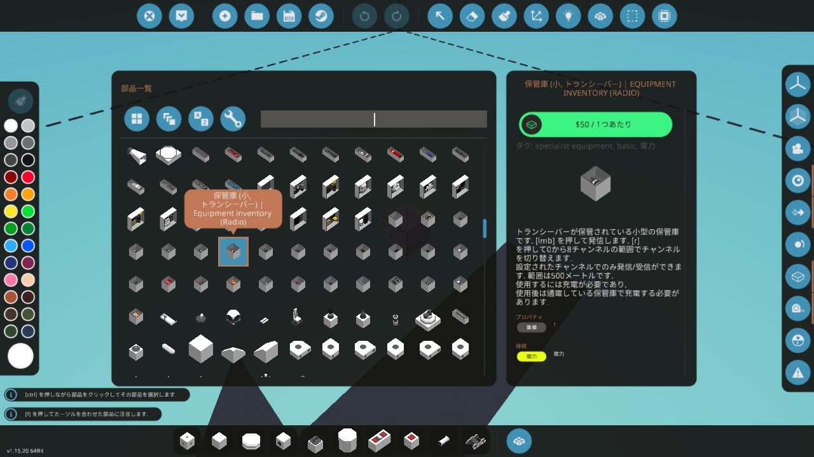
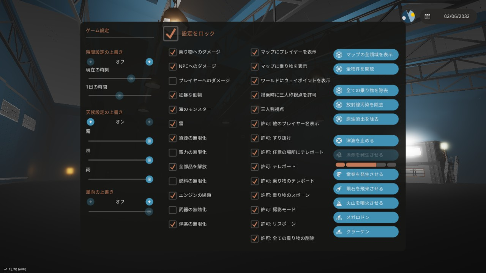

# Stormworks-JapaneseTranslation

乗り物製作シミュレーションゲーム「[Stormworks: Build and Rescue](https://store.steampowered.com/app/573090/Stormworks_Build_and_Rescue/)」のゲーム内テキストを日本語化する翻訳データです。

対応ゲームバージョン：**<!-- TARGET_GAME_VERSION_START -->1.15.18<!-- TARGET_GAME_VERSION_END -->**

## 翻訳データの適用方法

翻訳データの適用方法には次の2種類があります。

1. Steamワークショップから適用する方法（おすすめ）
2. 本リポジトリからビルドし、ローカルで適用する方法
