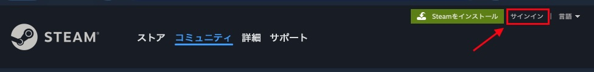
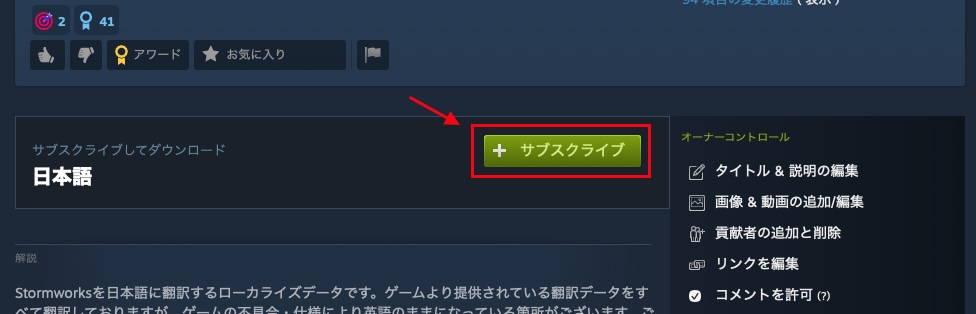
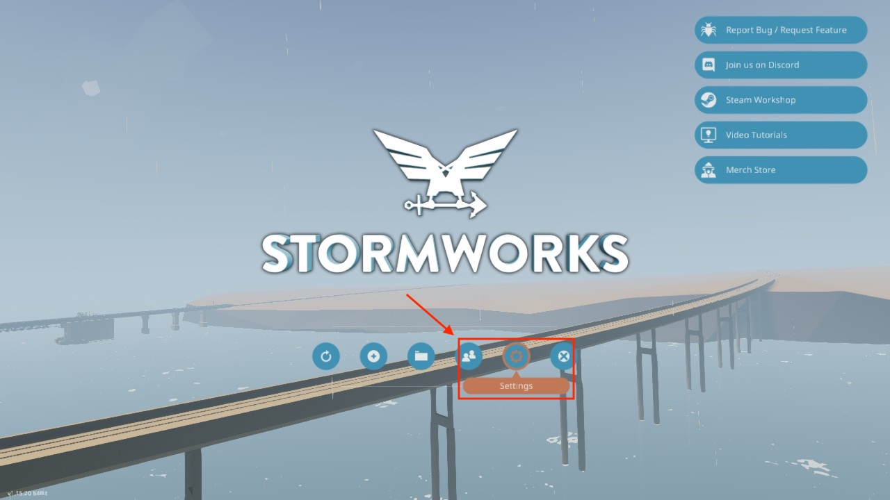
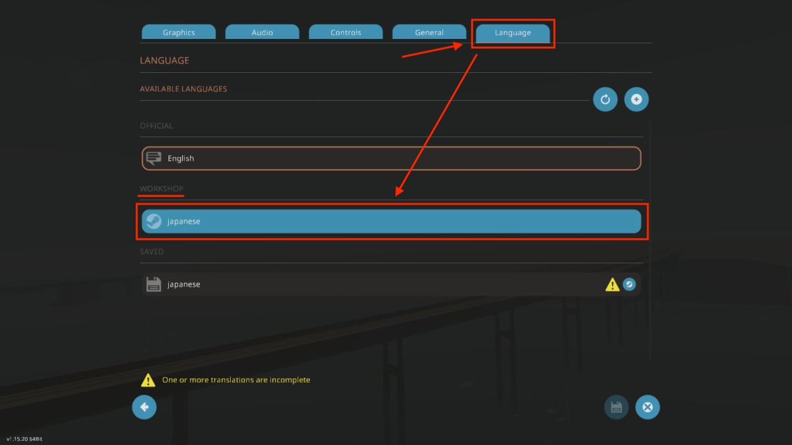
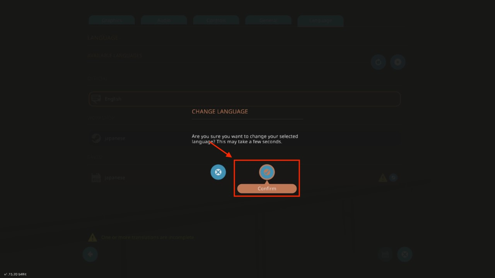
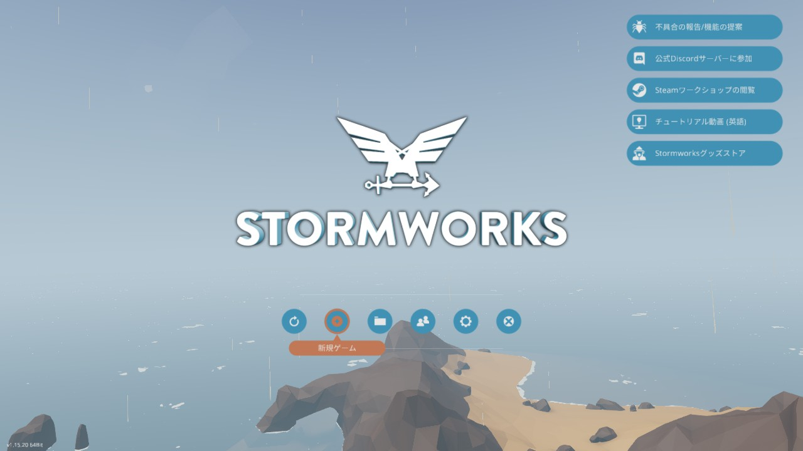
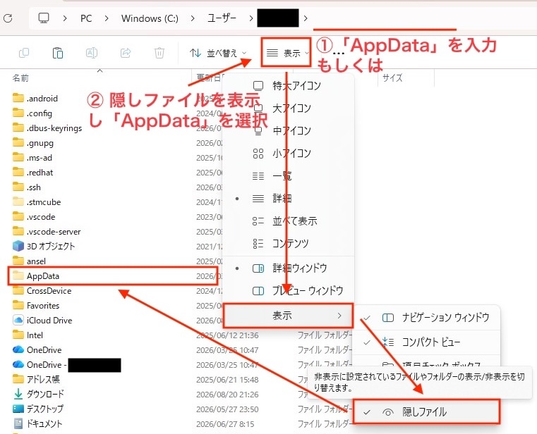
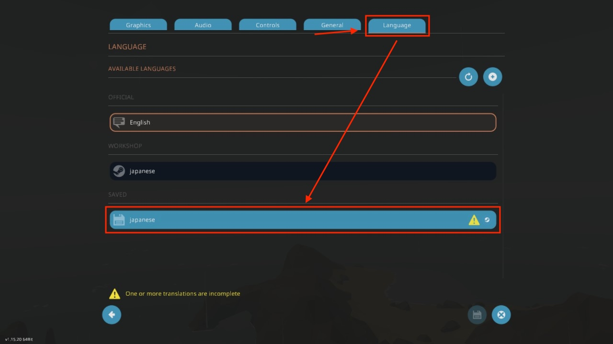

# Stormworks-JapaneseTranslation

乗り物製作シミュレーションゲーム「[Stormworks: Build and Rescue](https://store.steampowered.com/app/573090/Stormworks_Build_and_Rescue/)」のゲーム内テキストを日本語化する翻訳データです。

対応ゲームバージョン：**<!-- TARGET_GAME_VERSION_START -->1.15.18<!-- TARGET_GAME_VERSION_END -->**


## 翻訳データの適用方法

翻訳データの適用方法には次の2種類があります。

1. Steamワークショップから適用する方法（おすすめ）
2. ローカル上で直接適用する方法

### Steamワークショップからの適用（おすすめ）

こちらの方法では**Steamアカウント**が必要です。
SteamでStormworksを購入しているのであれば、Steamアカウントは作成しているはずです。

1. 以下のリンクより、Steamワークショップにアクセスします。

   <https://steamcommunity.com/sharedfiles/filedetails/?id=2081775581>

2. Steamにログインしていない場合は、Stormworksを購入したSteamアカウントでログインしてください。\
   （既にログインしている場合は、ログインボタンの場所にログインしているSteamアカウントが表示されます。）

   

3. 「サブスクライブ」ボタンを押して、翻訳データを購読してください（無料）。

   

4. Stormworksを起動します。

5. タイトル画面より「Settings（設定）」に移動します。

   

6. 「Language（言語）」タブを開き、「WORKSHOP（Steamワークショップ）」セクションにある「japanese」をクリックします。

   

7. 適用確認画面が表示されるため「Confirm（OK）」をクリックします。

   

8. ゲームロゴが表示されてしばらく経つと、タイトル画面が再び表示されます。
   ここまで作業すれば、日本語が適用されています。

   

## ローカル上での直接適用

1. [Releasesページ](https://github.com/Gakuto1112/Stormworks-JapaneseTranslation/releases)に移動します。

2. リリースの「Assets」セクション内に`japanese.zip`というファイルがあるため、これをダウンロードします。

3. ダウンロードしたファイルを展開し、`japanese.tsv`を取り出します。

4. `japanese.tsv`をStormworksの言語データディレクトリに移動させます。

   ```text
   C:\Users\<user_name>\AppData\Roaming\Stormworks\data\languages
   ```

   - 上記のパスはWindows環境でのデフォルトパスです。
     Windows以外のOSを使用している場合や、Steamゲームのインストール先を変更している場合は、上記のパスとは場所が異なります。
   - `AppData`は隠しフォルダです。
      エクスプローラーのアドレスバーに直接入力するか、隠しファイルを表示する設定にしてください。

     

5. Stormworksを起動します。

6. タイトル画面より「Settings（設定）」に移動します。

   

7. 「Language（言語）」タブを開き、「SAVED（保存済み）」セクションにある「japanese」をクリックします。

   

8. 適用確認画面が表示されるため「Confirm（OK）」をクリックします。

   

9. ゲームロゴが表示されてしばらく経つと、タイトル画面が再び表示されます。
   ここまで作業すれば、日本語が適用されています。

   
