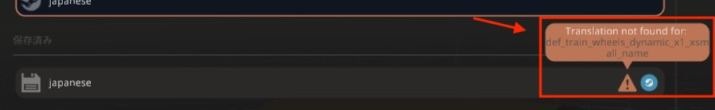

# CONTRIBUTING

本ドキュメントには、本リポジトリにプルリクエストを提出していただける方に対する注意事項をまとめてあります。
もしプルリクエストを提出していただく場合には一読ください。

## 和訳ルール

和訳において、次の2つのルールを定めています。
翻訳作業を行う際には、次のルールを守っていただきますよう、よろしくお願いします。

1. 使用禁止の文字は使用しないでください。
   現在使用を禁じている文字は以下のとおりです。

   <!-- markdownlint-disable MD033 -->
   | 禁止文字 | 禁止理由 | 代替文字 |
   | --- | --- | --- |
   | \| | 和訳文と英語原文の区切り文字に使用しているため。 | （なし） |
   | 、 | Stormworksのフォントでは日本語として表示がおかしくなるため。[^1] | 「, 」 （カンマの後に半角スペースを入れてください。） |
   | 。 | Stormworksのフォントでは日本語として表示がおかしくなるため。[^1] | 「. 」 （カンマの後に半角スペースを入れてください。） |
   | （全角スペース） | 半角スペースと混同しやすいため。 | （全角スペース） |
   | （タブ文字） | 翻訳ファイルのTSVファイルでは、タブ文字が行の区切り文字になるため。 | （なし） |
   <!-- markdownlint-enable MD033 -->

2. 翻訳の抜けがないようにしてください。
   - Stormworksの設定の「Language（言語）」タブ内の「SAVED（保存済み）」セクションにある「japanese」の項目に⚠️マークが表示されていないことを確認してください。
   - ⚠️マークが表示されている場合、マークをホバーすることで、翻訳漏れのキーが指摘されます。

     

## テストの実行

上記の和訳ルールは[テストスクリプト](../scripts/README.md#テストスクリプトtest)によって自動でテストされます。
プルリクエストをオープンにしたり、オープン後、更にプッシュしたりすると、その度にテストが実行されますので、テストには通過するようにしてください。

[^1]: Stormworksのフォントが中国語のフォントを流用しているため、このような表示になってしまうと思われる。
