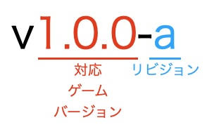

# タグ（バージョン）名

本ドキュメントでは、本リポジトリのタグ（バージョン）名について説明します。

## タグ名パターン

本リポジトリのタグ名は、以下の正規表現パターンに従います。

```regex
v(\d+\.){2}\d+\-[a-z]
```

例えば、`v1.15.20-a`がタグ名として該当します。

## タグ名構造

本リポジトリのタグ名は「対応ゲームバージョン」と「リビジョン」で構成されています。



例えば、`v1.15.20-a`の場合、「`1.15.20`」が対応ゲームバージョンに、「`a`」がリビジョンに該当します。

### 対応ゲームバージョン

この翻訳データのバージョンが、どのStormworksのゲームバージョンに対応しているのかを示します。

ある翻訳データのバージョンが複数のゲームバージョンに対応している場合は、対応しているゲームバージョンの中で最も古いゲームバージョンが示されます。

### リビジョン

同じ対応ゲームバージョン内において、その翻訳データが何回目のリリースであるかを示します。

1回目は「a」、2回目は「b」...というようにリビジョンが進行していきます。

翻訳データの対応ゲームバージョンが更新された場合は、リビジョンは「a」に戻ります。
