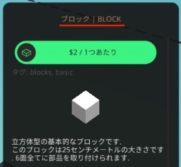

# 翻訳データスクリプト

本ディレクトリには、翻訳データの加工や検証を行うスクリプトが格納されています。
利用可能なスクリプトは次のとおりです。

| スクリプト | サブディレクトリ名 | 説明 |
| --- | --- | --- |
| ビルド | `build` | 翻訳データのソースから、和訳文に英語原文を結合する加工を行い、出力先ディレクトリ（`./dist`）に加工済み翻訳データを出力します。 |
| テスト | `test` | 翻訳データやREADMEドキュメントが適切かどうか、検証を行います。 |
| 更新確認 | `update_check` | Steamニュースからゲームの更新情報を取得し、必要であれば更新対応用のIssueを作成します。 |

## 共通セットアップ

スクリプトは[Python](https://www.python.org)で記述され、実行環境は[UV](https://docs.astral.sh/uv/)で管理されています。

事前にローカル上にUVをインストールしてください。

1. 本リポジトリをクローン（ダウンロード）し、お使いのデバイス上にファイルを展開します。

2. ワーキングディレクトリを`./scripts`に設定します。

3. Python及び依存パッケージのインストールをします。
   以下のコマンドを実行するだけでインストールできます。

   ```bash
   uv sync
   ```

## ビルドスクリプト（`./build`）

ビルドスクリプトは、翻訳データのソースファイルを加工し、配布用のファイルを生成するスクリプトです。
翻訳データのソースファイルから和訳文に英語原文を結合する加工を行なったものを出力します。

例えば、英語原文「*Block*」と和訳文「*ブロック*」がある場合、出力文は「*ブロック | Block*」となります。



和訳文と英語原文の間に挟まる文字列（区切り文字）は、[スクリプト設定ファイル](#スクリプト設定ファイル)から取得します。

本和訳文と英語原文を結合する仕様は、Stormworks日本語コミュニティからの要望を受けて取り入れています。

### 実行方法

カレントディレクトリを本ディレクトリにし、以下のコマンドを実行してください。

```bash
uv run python -m build.build
```

ソースファイルの入力は`../src/japanese.tsv`、ビルドファイルの出力は`../dist/japanese.tsv`にされます。
入出力ファイルはコマンドラインのオプション引数で変更できます。

### オプション引数

本ビルドツールにはオプション引数を用意しています。

| 引数名 | 追加引数 | 説明 |
| --- | --- | --- |
| -h, --help | なし | ビルドツールのオプションの説明を表示します。 |
| -i, --src-path | ソースファイルまでのパス | 翻訳データのソースファイルを指定します。本引数を指定しない場合は`../src/japanese.tsv`になります。 |
| -o, --dist-path | 出力先ファイルまでのパス | 出力先のファイルを指定します。本引数を指定しない場合は`../dist/japanese.tsv`になります。 |
| -l, --colored | なし | 標準出力に色を付けます。ログ出力などの制御文字がそのまま出力される場合はオフにしてください。 |
| -d, --debug | なし | より細かいデバッグ出力を有効にします。 |

## テストスクリプト（`./test`）

テストスクリプトは、翻訳データのソースファイルやREADMEドキュメントが正しいかどうかチェックし、その結果を報告するスクリプトです。
テストには以下の項目があります。

<!-- markdownlint-disable MD033 -->
| テストファイル名 | テスト内容 |
| --- | --- |
| [`test_prohibited_characters.py`](./test/test_prohibited_characters.py) | 和訳文内に禁止文字が含まれていないかテストします。<br>禁止文字のリストは[スクリプト設定ファイル](#スクリプト設定ファイル)から取得します。 |
| [`test_missing_translations`](./test/test_missing_translations.py) | 翻訳漏れの項目がないかテストします。<br>対応する英語原文がない項目はテスト対象外です。 |
| [`test_readme_game_version`](./test/test_readme_game_version.py) | タグ名とREADMEドキュメントに書かれている対応ゲームバージョンが一致しているかテストします。<br>本テストはシェルに環境変数`TAG_NAME`が設定されている場合のみ実行されます。<br>タグ名と対応ゲームバージョンの関係性については[タグ名説明ドキュメント](../docs/tag_name.md)を確認してください。 |
<!-- markdownlint-enable MD033 -->

### 実行方法<!-- markdownlint-disable-line MD024 -->

カレントディレクトリを本ディレクトリにし、以下のコマンドを実行してください。

```bash
uv run python -m xmlrunner discover -s ./test -p "test_*.py" -o ./test/reports  
```

テスト実行後、レポートファイルが`./test/reports`に出力されます。

## アップデート確認スクリプト（`./update_check`）

アップデート確認スクリプトは、Steamニュースからゲームの更新情報を取得し、必要であればゲーム更新後の対応を促すIssueを作成するスクリプトです。
本スクリプトはローカルでの実行を想定していません。

本スクリプトでは以下のコマンドライン引数が必要です。

<!-- markdownlint-disable MD033 -->
| 引数名 | 説明 |
| --- | --- |
| `last_timestamp` | 最後に更新確認した際のUNIXタイムスタンプを指定します。 <br> 通常はワークフローで自動設定します。 |
<!-- markdownlint-enable MD033 -->

さらに、本スクリプトでは、以下の環境変数を使用します。

<!-- markdownlint-disable MD033 -->
| 環境変数名 | 説明 |
| --- | --- |
| `GITHUB_TOKEN` | GitHub ActionsからIssueを作成するためのアクセストークンです。 <br> 通常はGitHub Actionsのランタイム内にあるものを使用します。 |
| `ACTIONS_VARIABLES_TOKEN` | GitHub ActionsからActions Variablesを更新するためのアクセストークンです。 <br> 対象のリポジトリに対してVariablesの読み書き権限が与えられたアクセストークンをActions Secretsに同名のトークンとして登録しておきます。 |
| `GITHUB_REPOSITORY` | Issueの作成やActions Variablesの更新を行う対象のリポジトリを示す文字列です。（例: `Gakuto1112/Stormworks-JapaneseTranslation`） <br> 通常はGitHub Actionsのランタイム内にあるものを使用します。 |
<!-- markdownlint-enable MD033 -->

本スクリプトをフォークして使用する場合は、自身のアカウントで、本リポジトリに対してVariablesの読み書き権限が与えられたFine-grained PATを発行し、リポジトリのActions Secretsに`ACTIONS_VARIABLES_TOKEN`という名称で登録してください。

### Actions Variables

本スクリプトは変数保持のため、GitHubのActions Variablesを使用します。
本リポジトリをフォークして使用する場合は、以下の変数をActions Variablesに登録してください。

<!-- markdownlint-disable MD033 -->
| 変数名 | 説明 |
| --- | --- |
| `LAST_TIMESTAMP` | 最後に更新確認を行った際のUNIXタイムスタンプです。 <br> スクリプトは本タイムスタンプから現在のタイムスタンプまでの期間のSteamニュースを抽出して更新確認を行います。 <br> 本変数の更新は、Actions Variablesに登録したアクセストークンを用いて、スクリプトから行います。 |
<!-- markdownlint-enable MD033 -->

## スクリプト設定ファイル

[`config.toml`](./config.toml)には、スクリプトの設定が保存されており、スクリプトの実行時に設定ファイルから読み込まれ、使用されます。

セクション構成は以下のとおりです。

| セクション名 | 説明 |
| --- | --- |
| `build` | [ビルドスクリプト](#ビルドスクリプトbuild)に関する設定 |
| `test` | [テストスクリプト](#テストスクリプトtest)に関する設定 |

### buildセクション

`build`セクションにある設定値は以下のとおりです。

| 設定名 | データ型 | 説明 |
| --- | --- | --- |
| `separator` | string | 和訳文と英語原文の間に挿入する文字列(区切り文字)を指定します。 |

### testセクション

`test`セクションにある設定値は以下のとおりです。

| 設定名 | データ型 | 説明 |
| --- | --- | --- |
| `prohibited_characters` | string[] | 和訳文の中で使用してはいけない禁止文字列を指定します。 |
